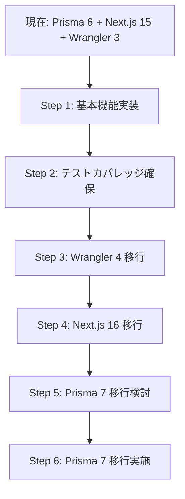

# メジャーアップデート移行計画

## 概要

現在保留されているメジャーアップデートの調査結果と移行計画をまとめたドキュメントです。

## 保留中のメジャーアップデート

| パッケージ | 現在 | 最新 | 優先度 | 影響度 |
|-----------|------|------|--------|--------|
| Prisma (client/adapter/CLI) | 6.19.2 | 7.3.0 | 高 | 高 |
| Next.js | 15.5.9 | 16.1.4 | 高 | 中 |
| Wrangler | 3.114.17 | 4.60.0 | 中 | 低 |
| @types/node | 22.x | 25.x | 低 | 低 |

---

## 1. Prisma 7 移行 (最優先)

### 📚 参考資料

- [公式移行ガイド](https://www.prisma.io/docs/orm/more/upgrade-guides/upgrading-versions/upgrading-to-prisma-7)
- [Prisma 7 リリースブログ](https://www.prisma.io/blog/announcing-prisma-orm-7-0-0)
- [GitHub Issue #28573](https://github.com/prisma/prisma/issues/28573)

### 🔴 主な破壊的変更

#### 1.1 設定ファイルの移行 (`prisma.config.ts`)

**変更内容:**

- `schema.prisma` から `prisma.config.ts` への設定移行が必要
- データベース接続URLは `prisma.config.ts` で管理
- 環境変数の扱いが変更

**現在の設定 (`prisma/schema.prisma`):**

```prisma
datasource db {
  provider  = "postgresql"
  url       = env("DATABASE_URL")
  directUrl = env("DIRECT_URL")
}
```

**移行後 (`prisma.config.ts`):**

```typescript
import { defineConfig } from '@prisma/client'

export default defineConfig({
  datasourceUrl: process.env.DATABASE_URL,
  adapter: 'postgresql', // または @prisma/adapter-pg を使用
})
```

#### 1.2 Driver Adapter 必須化

**変更内容:**

- Prisma Client がアダプターベースのアーキテクチャに移行
- PostgreSQL用に `@prisma/adapter-pg` が必要

**影響:**

- 依存関係に `@prisma/adapter-pg` を明示的に追加
- PrismaClient の初期化方法が変更

#### 1.3 非同期API

**変更内容:**

- 一部のAPIが非同期化される可能性

**影響:**

- コードレビューと修正が必要

#### 1.4 マップされたEnum型の問題

**変更内容:**

- `@map` を使用したEnum型に既知のバグ ([Issue #28930](https://github.com/prisma/prisma/issues/28930))

**影響:**

- 現在のスキーマでEnum型を使用している場合は要確認

### ⚠️ リスク評価

- **互換性:** 高リスク - 設定ファイル構造の大幅変更
- **工数:** 中〜大 - スキーマ移行とテスト必須
- **ダウンタイム:** なし（適切な移行手順で）

### 📋 移行手順 (推奨)

**Phase 1: 準備**

1. 現在の Prisma 6 スキーマのバックアップ
2. テストデータベースで検証

**Phase 2: アップグレード**

1. `prisma.config.ts` の作成
2. `schema.prisma` から設定を移行
3. `@prisma/adapter-pg` のインストール
4. PrismaClient の初期化コード更新

**Phase 3: 検証**

1. マイグレーション実行の確認
2. 全テストの実行
3. 本番環境でのスモークテスト

### 🎯 推奨アクション

**当面は Prisma 6 を継続使用し、以下のマイルストーン後に移行:**

1. 基本機能（習慣管理）の実装完了
2. テストカバレッジの十分な確保
3. Prisma 7 の安定化（v7.5+ を推奨）

---

## 2. Next.js 16 移行 (高優先度)

### 📚 参考資料

- [公式アップグレードガイド](https://nextjs.org/docs/app/guides/upgrading/version-16)
- [Next.js 16 リリースブログ](https://nextjs.org/blog/next-16)
- [完全移行ガイド](https://codelynx.dev/posts/nextjs-16-complete-guide)

### 🔴 主な破壊的変更

#### 2.1 非同期Request API (必須対応)

**変更内容:**

- `params`, `searchParams`, `cookies()`, `headers()`, `draftMode()` が非同期化
- 同期アクセスは完全に削除

**影響範囲:**

```typescript
// Before (Next.js 15)
export default function Page({ params, searchParams }) {
  const id = params.id
}

// After (Next.js 16)
export default async function Page({ params, searchParams }) {
  const { id } = await params
}
```

**現在のプロジェクトへの影響:**

- `src/app/sign-in/[[...sign-in]]/page.tsx`
- `src/app/sign-up/[[...sign-up]]/page.tsx`
- その他の動的ルート

#### 2.2 Node.js バージョン要件

**変更内容:**

- Node.js 18 のサポート終了
- Node.js 20.9 以上が必須

**現在の環境:**

- mise.toml: `node = "24.12"` ✅ 問題なし

#### 2.3 Turbopack がデフォルト

**変更内容:**

- 開発モードで Turbopack がデフォルト有効

**現在の設定:**

- `package.json`: `"dev": "next dev --turbopack"` ✅ 既に対応済み

#### 2.4 next/image のデフォルト変更

**変更内容:**

- 画像最適化のデフォルト設定が変更

**影響:**

- 現在 `next/image` を使用していない → 影響なし

#### 2.5 AMP サポート削除

**変更内容:**

- AMP サポートが完全に削除

**影響:**

- 現在使用していない → 影響なし

### ⚠️ リスク評価

- **互換性:** 中リスク - 非同期APIへの対応が必須
- **工数:** 小〜中 - ページコンポーネントの修正のみ
- **ダウンタイム:** なし

### 📋 移行手順 (推奨)

**Phase 1: 自動アップグレード**

```bash
npx @next/codemod@canary upgrade latest
```

**Phase 2: 手動修正**

1. 動的ルートページの非同期化
2. `params` / `searchParams` へのawait追加
3. Clerk認証ページの修正

**Phase 3: 検証**

1. 開発環境での動作確認
2. ビルドの成功確認
3. 全テストの実行

### 🎯 推奨アクション

**Prisma 7 より先に移行可能:**

- 影響範囲が限定的
- 自動移行ツールが利用可能
- セキュリティアップデートの恩恵

**移行タイミング:**

- 基本機能実装後、Prisma 7 より先に実施
- 1-2 PRで完了可能

---

## 3. Wrangler 4 移行 (中優先度)

### 📚 参考資料

- [公式移行ガイド](https://developers.cloudflare.com/workers/wrangler/migration/update-v3-to-v4/)
- [Wrangler v4 Changelog](https://developers.cloudflare.com/changelog/2025-03-13-wrangler-v4/)

### 🟡 主な破壊的変更

#### 3.1 Node.js サポート

**変更内容:**

- Node.js 16 のサポート終了
- Node.js の公式サポートライフサイクルに準拠

**現在の環境:**

- mise.toml: `node = "24.12"` ✅ 問題なし

#### 3.2 esbuild アップグレード

**変更内容:**

- esbuild 0.17.19 → 0.24
- 動的ワイルドカードインポートに影響の可能性

**影響:**

- 現在のコードベースで動的インポートを確認

#### 3.3 ローカルモードがデフォルト

**変更内容:**

- 全コマンドがローカルモードで実行
- リモート実行には `--remote` フラグが必要

**影響:**

- デプロイワークフローの確認

#### 3.4 削除された機能

**変更内容:**

- Legacy Assets 削除
- Legacy Node.js compatibility (`node_compat`) 削除
- `getBindingsProxy()` 削除

**影響:**

- 現在使用していない → 影響なし

### ⚠️ リスク評価

- **互換性:** 低リスク - ほとんどのユーザーに影響なし
- **工数:** 小 - 設定確認のみ
- **ダウンタイム:** なし

### 📋 移行手順 (推奨)

**Phase 1: アップグレード**

```bash
pnpm add -D wrangler@^4.60.0
```

**Phase 2: 検証**

1. `wrangler.jsonc` の設定確認
2. ローカル開発環境での動作確認
3. デプロイテスト

**Phase 3: OpenNext 互換性確認**

- `@opennextjs/cloudflare` が Wrangler 4 を期待しているため、ピアwarning解消

### 🎯 推奨アクション

**最も影響が少ない移行:**

- ほぼ no-op アップグレード
- OpenNext との互換性向上

**移行タイミング:**

- Next.js 16 移行と同時に実施可能
- 最も早く完了できる

---

## 4. @types/node 25 移行 (低優先度)

### 🟢 主な変更

**変更内容:**

- Node.js 25.x の型定義

**影響:**

- 現在 Node.js 24.12 を使用
- Node.js 25 リリース後に対応

### 🎯 推奨アクション

**Node.js 25 がLTSになってから対応:**

- 現時点では不要
- Node.js 24 のサポート期間内は現状維持

---

## 総合移行計画

### 推奨移行順序



### タイムライン (推定)

| Phase | タスク | 期間 | リスク |
|-------|--------|------|--------|
| Phase 1 | 基本機能実装 | 2-3週 | - |
| Phase 2 | テストカバレッジ | 1週 | - |
| Phase 3 | Wrangler 4 移行 | 1日 | 低 |
| Phase 4 | Next.js 16 移行 | 2-3日 | 中 |
| Phase 5 | Prisma 7 移行準備 | 1週 | - |
| Phase 6 | Prisma 7 移行実施 | 3-5日 | 高 |

### 次のステップ

1. ✅ **このドキュメントのレビュー** - ユーザー確認
2. ⏳ **基本機能の実装開始** - Prisma 6 + Next.js 15で実装
3. ⏳ **Wrangler 4 移行** - 最も簡単な移行から
4. ⏳ **Next.js 16 移行** - セキュリティ重視
5. ⏳ **Prisma 7 移行** - 機能実装完了後

---

## 備考

- このドキュメントは調査結果に基づいた推奨案です
- 実際の移行前に各バージョンの最新情報を再確認してください
- 本番環境への適用前に必ずステージング環境でテストしてください

## Sources

- [Prisma 7 Upgrade Guide](https://www.prisma.io/docs/orm/more/upgrade-guides/upgrading-versions/upgrading-to-prisma-7)
- [Prisma 7 Release Blog](https://www.prisma.io/blog/announcing-prisma-orm-7-0-0)
- [Next.js 16 Upgrade Guide](https://nextjs.org/docs/app/guides/upgrading/version-16)
- [Next.js 16 Blog](https://nextjs.org/blog/next-16)
- [Wrangler v4 Migration Guide](https://developers.cloudflare.com/workers/wrangler/migration/update-v3-to-v4/)
